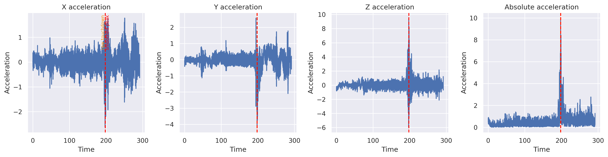
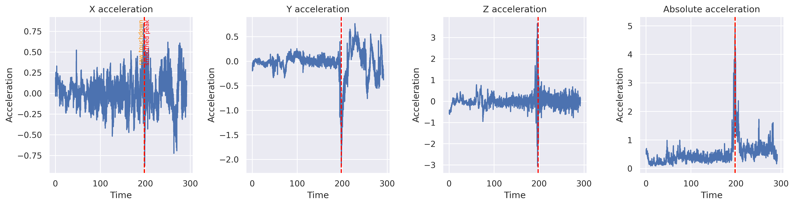
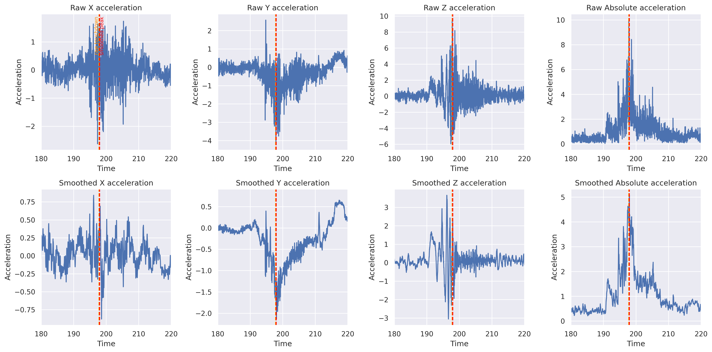
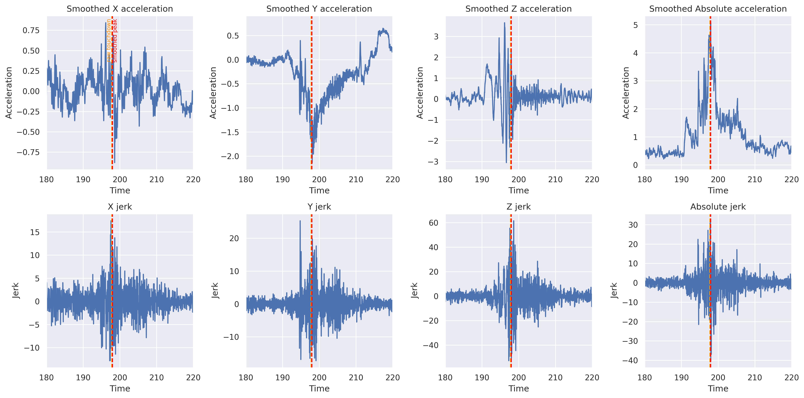
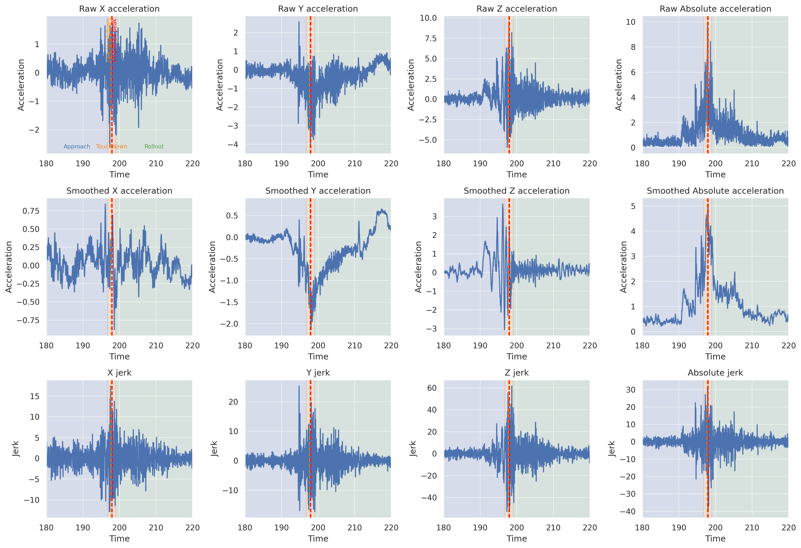

# Landing Analysis Report

## Summary

This report analyzes phone accelerometer data recorded during an aircraft landing. The data was smoothed with a rolling mean, then used to estimate touchdown timing, dynamic acceleration, jerk, rollout roughness, and an overall landing grade.

## Key Metrics

| Metric | Value |
|---|---:|
| Raw touchdown time | 197.77 s |
| Smoothed touchdown time | 197.97 s |
| Raw peak dynamic acceleration | 9.99 m/s^2 |
| Smoothed peak dynamic acceleration | 5.08 m/s^2 |
| Smoothed peak dynamic acceleration | 0.52 g |
| Max absolute jerk | 40.18 m/s^3 |
| Max absolute jerk time | 197.99 s |
| Rollout roughness score | 2.69 |
| Landing grade | 8.40 / 10 |

## Touchdown Detection

Touchdown was estimated from the maximum absolute acceleration. The raw touchdown marker identifies the sharpest measured acceleration spike, while the smoothed touchdown marker uses the rolling-mean signal to reduce sensor noise.

## Jerk And Roughness

Jerk was calculated as the change in acceleration divided by the change in time. The roughness score uses RMS absolute jerk after touchdown, so stronger post-touchdown vibration increases the roughness value.

## Interpretation

The landing shows a clear acceleration event around 198 seconds. The raw signal captures the sharpest instant of impact, while the rolling-smoothed signal gives a more stable touchdown marker. The jerk signal peaks in the same time window, which supports the touchdown detection.

## Generated Plots

### Raw acceleration overview

### Smoothed acceleration overview

### Raw and smoothed comparison

### Smoothed acceleration and jerk

### Full landing analysis

